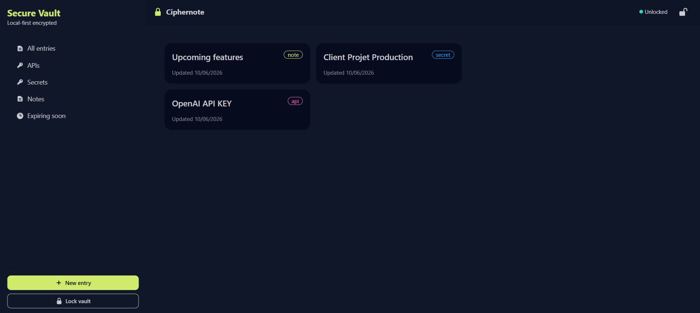

# Ciphernote

> A **local-first, zero-knowledge** vault for API keys, secrets, and notes. Everything is encrypted in your browser with the Web Crypto API — plaintext never touches disk and there is no server to trust.

Ciphernote is a single-page React app backed entirely by IndexedDB. You unlock it with a passphrase that is never stored anywhere; that passphrase derives the key that unwraps your data. Lose the passphrase and the data is unrecoverable — which is the point.

<!-- TODO: add a screenshot or short GIF of the vault here -->
<!--  -->

---

## Why this exists

Most "secrets managers" either ship your data to a backend or store it in plaintext `localStorage`. Ciphernote is a demonstration of doing it properly on the client:

- **Zero-knowledge** — the app only ever persists ciphertext. There is no backend, no account, and nothing to breach server-side.
- **Local-first** — all data lives in the browser's IndexedDB. The app works fully offline.
- **Real cryptography** — AES-GCM for confidentiality + integrity, PBKDF2 for passphrase hardening, and an envelope-encryption scheme so the passphrase can change without re-encrypting every entry.

---

## Security model

Ciphernote uses **envelope encryption**: a long, random *master key* encrypts your data, and a *passphrase-derived key* encrypts the master key.

```
passphrase ──PBKDF2(SHA-256, 310k iters, 16-byte salt)──▶  KEK (key-encryption key)
                                                              │
master key (random AES-256) ──────────────────────────────── wrapped by KEK ──▶ stored in IndexedDB
        │
        └─ AES-GCM(random 12-byte IV) ──▶ each entry's ciphertext ──▶ stored in IndexedDB
```

**Setup (first run)**
1. A 256-bit master key is generated with `crypto.subtle.generateKey`.
2. A 16-byte random salt is generated; the passphrase is stretched into a KEK via PBKDF2-SHA-256 (310,000 iterations).
3. The master key is wrapped (AES-GCM) under the KEK and written to IndexedDB alongside the salt, IV, and iteration count. **The passphrase and the raw master key are never persisted.**

**Unlock**
1. The KEK is re-derived from the entered passphrase and the stored salt.
2. The wrapped master key is decrypted. A wrong passphrase fails the GCM authentication tag, so unlock simply fails — no oracle, no partial data.
3. The unwrapped master key is held **in memory only** (Zustand store) for the session and cleared on lock.

**Per-entry encryption**
- Each entry value is encrypted with the master key under AES-GCM with a fresh random 12-byte IV, so identical values never produce identical ciphertext.
- GCM's authentication tag means any tampering with stored ciphertext is detected on decrypt.

### What it protects against
- Disk/backup theft or inspection of IndexedDB: contents are ciphertext, useless without the passphrase.
- Server-side breach: there is no server.

### What it does *not* protect against (honest limitations)
- **Malicious code in the page** (XSS, a hostile dependency, or a browser extension) while the vault is unlocked — the master key is in memory at that point.
- **A weak passphrase.** PBKDF2 raises the cost of brute force but cannot save a guessable passphrase. The built-in generator produces 6-word passphrases to encourage strong ones.
- **A compromised device** (keyloggers, malware). Client-side crypto trusts the client.

These trade-offs are inherent to browser-based, server-free encryption and are stated deliberately rather than hidden.

---

## Tech stack

| Area | Choice |
|------|--------|
| UI | React 19 + TypeScript |
| Build | Vite |
| Routing | React Router 7 |
| State | Zustand |
| Storage | IndexedDB (via `idb`) |
| Crypto | Web Crypto API (`crypto.subtle`) — AES-GCM, PBKDF2 |
| Styling | Tailwind CSS + daisyUI |
| Tests | Vitest |

---

## Getting started

Requires Node 20+ (or [Bun](https://bun.sh)). All commands run from `client/`.

```bash
cd client

# install
bun install         # or: npm install

# run the dev server
bun run dev         # or: npm run dev

# type-check + production build
bun run build

# lint
bun run lint

# run the crypto test suite
bun run test
```

Then open the printed local URL, create a vault with a passphrase, and start adding entries. Because everything is local, your data stays in that browser profile only.

---

## Project structure

```
client/src/
├── domain/
│   ├── crypto/        # Web Crypto primitives: kdf, encrypt, decrypt, random
│   │   └── crypto.test.ts   # round-trip, tamper, and vault-flow tests
│   ├── vault/         # vault lifecycle: init / unlock / lock (envelope encryption)
│   ├── entries/       # encrypt/decrypt entries + (de)serialization
│   └── db/            # IndexedDB client, schema, and stores
├── store/             # Zustand stores (vault status + in-memory master key)
├── components/        # atoms / molecules / organisms / templates
├── pages/             # route screens (Splash, Unlock, VaultSetup, VaultHome…)
└── routes/            # router + auth guards (RequireVault / RequireUnlocked)
```

The cryptography lives entirely in `domain/crypto/` and is covered by `crypto.test.ts` (round-trips, IV freshness, tamper detection, wrong-passphrase failure, and the full setup → unlock → decrypt vault flow).

---

## Testing

```bash
cd client
bun run test        # one-shot
bun run test:watch  # watch mode
```

The suite runs against the real Web Crypto implementation (Node's `crypto.subtle`), so it exercises the same code paths as the browser.

---

## License

MIT — see [LICENSE](LICENSE).
